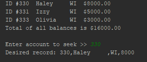
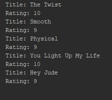

<h1> Chapter 13 </h1>

 A try and catch statement are two separate blocks that work together in a program. The try statement executes a block of code
and tests it for errors. The catch block is there to "catch" or process any exception errors that may occur from the code in the
try block. If the catch block doesn't handle the exception, that means the wrong handler was used to catch the error. 

Read Text Files:

First, the program has the user enter the file they want to read, so the program knows where to retrieve data from. Next, the program uses a try catch block. The try statement contains an InputStream and a BufferedReader, which reads data from the text files.
Then, there is another try catch block that uses a file channel which is used to read data from the file. It alsohas a ByteBuffer that also reads data from a file. So when the user enters the account number they are trying to seek,the
program uses file channel (fc) to find the position of the desired account and then fc to read the data (buffer is used in this to speed up process I think). Then the catch block is there to throw any potential errors. That is how text is read on
the text files. 

Write to Text Files: 

 First, the program retrieves the filepaths of the two text files InStateCusts.txt and OutOfStateCusts.txt. Next, the method createEmptyFile is called. This method contains a BufferedWriter and an OutputStreamWriter.
This method places the initial  text on the file, which in this case is 1000 placeholder values for customer account number, name, and state. Next, a try
catch block is in the program, which is where the user enters data. Next, the file channels open the file, which allows the data the user enters to be written in the placeholders in
the text files, however it doesn't actually place the user entries there yet, the ByteBuffer helps with this.The buffer transfers the bytes from the file channels to the actual file. After
this, the catch statement is there to catch any possible errors. That is how text is written on the text files.  

  ReadStateFile working: 

 

<h1> Lesson 1.2.1 </h1>

#3: The first method is readString, it has no parameters and a return type of String. The method's purpose is to open the file (if needed),
and then reads a line from the file, then return the line. The second method is writeString, it has the parameter String s and a return
 type of void. The method's purpose is to open the file (if needed), and then writes a string to the file, writing a new line. The last
 method is saveAndClose, it has no parameters and a return type of void. The method's purpose is to save and close the file when it is
 opened for input or output.

#29: Personally, I would probably use a for loop because you can limit the amount of times the loop iterates in the first line
  of the loop. I find them to be cleaner, and less chance of infinitely looping.

 Looping Media Lib working:

  

Conclusion #1: A for loop should be used when you know how many times the loop should iterate because in a for loop you state
how many time the loop will iterate in the first line of the loop. A while loop should be used when you don't know how many times
the loop should iterate, so it should loops on a condition until it needs to stop.

 Conclusion #2: Android OS 3.0 Honeycomb was created for tablets, it could support a larger screen size. Maintaining the older version of Gingerbread became pointless because it was not made to suppor tablets like Honeycomb was.  

